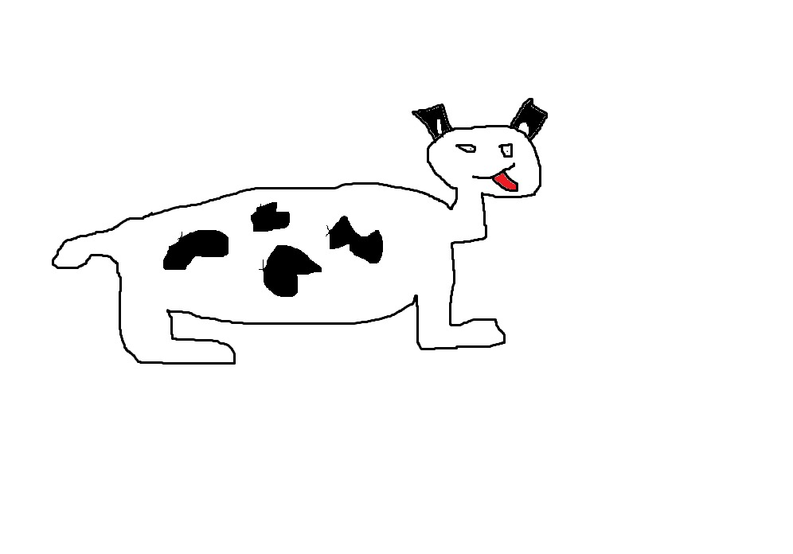

# 🎨 Live Lines Cartoon Generator

**Live Lines Cartoon Generator** is an AI-powered tool that brings your drawings to life!  
Using **Runware**’s generative video models, it transforms static cartoon images into short, animated videos.  

Upload a drawing (preferably a cartoon), describe the scene in a prompt if you like, and get back a short video clip — just like magic. ✨

---

## 🧩 Features

- 🖼️ Upload any drawing or cartoon image as input  
- 🎬 Generate a short animated video from it  
- 💬 Guide the animation using a text prompt (e.g., *“The cartoon waves and smiles”*)  
- ⚙️ Adjust video size and duration  
- 🔄 Change the underlying **Runware model** from `runware_service.py` (Default is bytedance) 
- 💾 Automatically downloads the generated video locally  

---

## 📸 Example

### Input Image

### Output Video
🎥 [Example Output Video](output/videos/cartoon_dog.gif)

